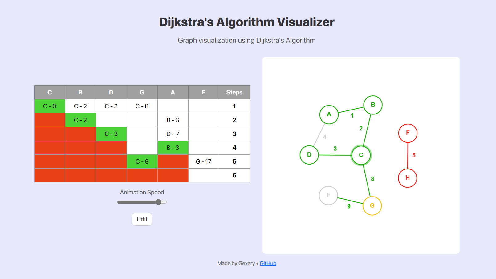

# Dijkstra Visualizer

## Description
This project is a visual representation of Dijkstra's algorithm, built entirely from scratch using HTML5, CSS3, and JavaScript. It showcases how Dijkstra's algorithm finds the shortest path in a graph, with interactive elements that allow users to visualize each step of the algorithm.

## Features
- **Graph Creation**: Users can create nodes and edges to form a graph.
- **Algorithm Visualization**: Step-by-step visualization of Dijkstra's algorithm, including path selection and cost calculation.
- **Interactive Interface**: Users can interact with the graph by selecting the start node and adjusting the speed of the animation.
- **Dynamic Updates**: Real-time updates of node states and edge weights during the algorithm's execution.

## Technologies Used
- **HTML5**: Structure and layout of the visualizer.
- **CSS3**: Styling of the visualizer elements for a better user experience.
- **JavaScript**: Core logic for graph handling, Dijkstra's algorithm implementation, and user interactions.
  - `node.js`: Handles individual nodes within the graph, including drawing and position updates.
  - `edge.js`: Manages edges between nodes, including weight display and visual state changes.
  - `graph.js`: Overall graph management, including node and edge addition, removal, and drawing.
  - `dijkstra.js`: Implements the Dijkstra algorithm, manages the priority queue, and updates the UI with each step.
  - `script.js`: Coordinates interactions between the user and the visualizer, handling events and initial setup.

## How to Use
1. **Graph Setup**:
    - Double click on the canvas to add nodes.
    - Double click and drag from one node to another to create edges.
    - Set the weight of each edge when prompted.

2. **Running the Algorithm**:
    - Click the "Start" button to initiate the process.
    - Select the start node for the algorithm by clicking on it.
    - The visualizer will animate the steps of Dijkstra's algorithm, showing the shortest path from the start node to all other nodes.

3. **Controls**:
    - Use the speed slider to adjust the animation speed.
    - Click the "Edit" button to reset the graph and make changes.

Enjoy exploring and understanding Dijkstra's algorithm with this visualizer!
